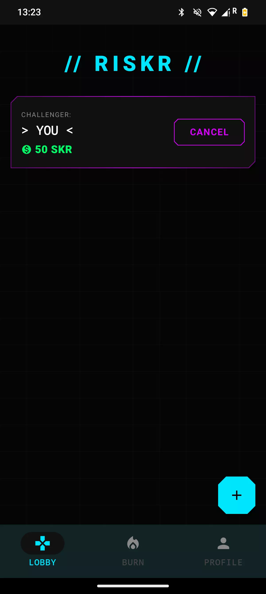
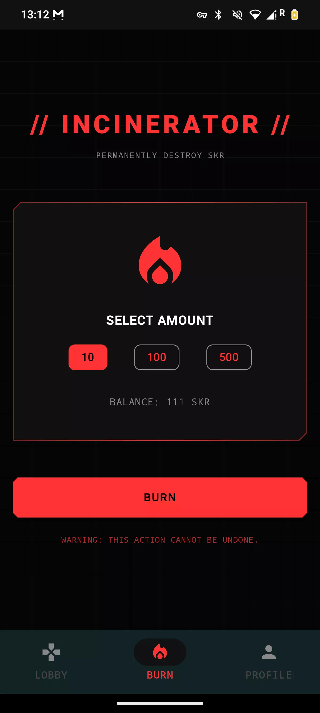
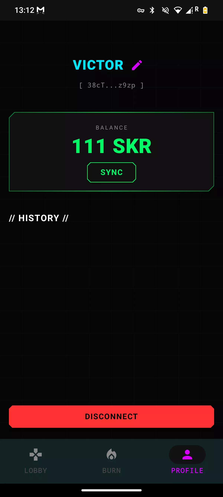

# RISKR: Cyberpunk Solana PVP Arena ⚔️

> **50/50 Odds. 100% Adrenaline. Prove your luck on-chain.**

## 💡 Inspiration
We wanted to bring the purest form of gambling—Rock Paper Scissors—onto the blockchain.

## 🚀 What it does
RISKR is a decentralized mobile game where players stake **$SKR** tokens in high-stakes 1v1 duels.
* **Lobby System**: Create or join rooms with 10, 100, or 500 SKR bets.
* **Winner Takes All**: The winner gets the pot (minus a small platform fee).
* **Incinerator**: A feature to permanently burn tokens, driving scarcity.
* **Fairness**: Draws are automatically fully refunded.

## 🛠️ Tech Stack
* **Blockchain**: Solana
* **Mobile**: Android
* **Backend**: Node.js
* **Database**: Firebase Firestore
* **Wallet**: Solana Mobile Wallet Adapter

## 📱 Screenshots
| Lobby | Burn | Profile |
|:---:|:---:|:---:|
|  |  |  |

## 🔧 How to run

### Backend
1. `cd backend`
2. `npm install`
3. Set up `.env` with your Treasury Keypair.
4. `node server.js`

### Android
1. Open `/android` in Android Studio.
2. Sync Gradle.
3. Build & Run on a device with Wallet installed.
